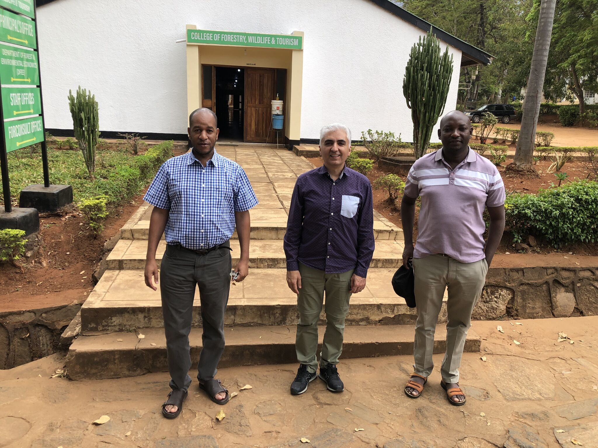
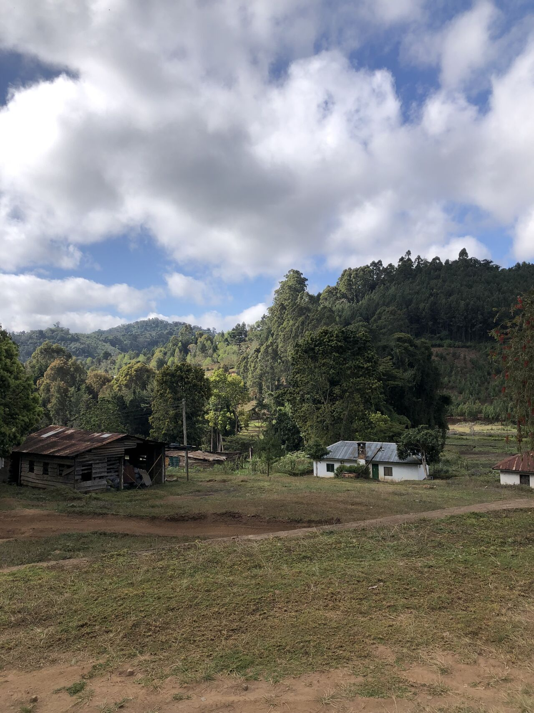
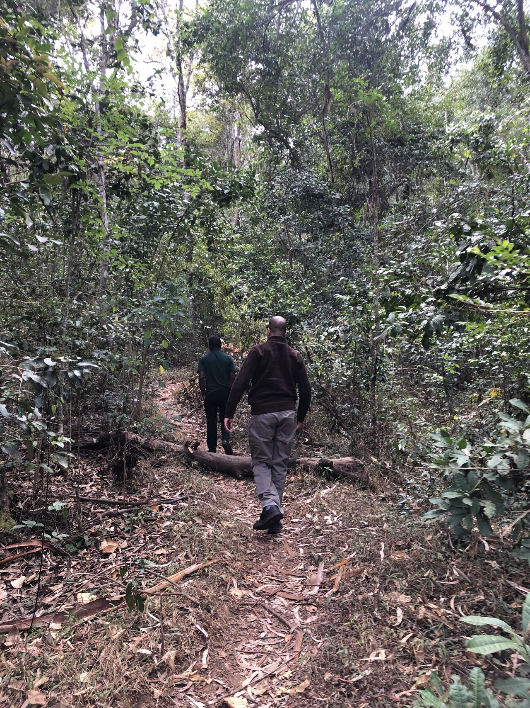

  
  
  

# TANZEO-BioStock:
Enhancing Biomass and Carbon Stock Estimation in Tanzanian Forests: Integrating Earth Observation and Machine Learning for Sustainable Forest Management and Food Security 

## Overview
**TANZEO-BioStock** is a research project providing forest canopy height (FCH), above-ground biomass (AGB), and above-ground carbon (AGC) datasets derived from multi-source Earth observation data for the **West Usambara Mountains, Tanzania**.

The project supports scientific analyses presented in peer-reviewed publications and promotes open and reproducible research in remote sensing and forest carbon assessment. This project is funded by EO AFRICA R&D Facility, in coordination with the European Space Agency (ESA) and the African Union Commission (AUC).
More info: https://www.eoafrica-rd.org/announcing-the-eo-africa-rd-research-projects-awarded-proposals-third-call/

Preliminary results presented at LPS2025, Vienna: https://www.eoafrica-rd.org/wp-content/uploads/docs/research_projects/fourth_call/highlights/10_LPS25_EOAfrica_TANZEO.pdf

---

## 📦🔗 Data and Software Availability

- Forest canopy height, biomass, and carbon stock datasets for the West Usambara Mountains, Tanzania available on Zenodo: 
- 
- The TANZEO-BioStock source code (v1.0.0) is archived on Zenodo:  

---

## 📄 Related Publications
Each paper directory contains the corresponding source code, configuration files, and usage instructions.

- **Phase 1:**  [Wall-to-Wall Mapping of Forest Canopy Height using ICESat-2 Data and Multi-source Remote Sensing Images in a Machine Learning Framework](papers/paper1)
  
- **Phase 2:**  [Forest Canopy Height Mapping in Tanzanian Tropical Rainforests Using Multimodal Remote Sensing Data and Machine Learning](papers/paper2)

---

## 👥 Project Team
- **Seyed Ehsan Khankeshizadeh** – Data collection, analysis, modeling  
- **Sadegh Jamali** – Project PI  
- **William Mauya** – Project PI, Field data collection  
- **Soheil Zaghian** – Methodology and validation  
- **Torbern Tagesson** – Scientific consultation  
- **Ali Mohammadizadeh** – Supervision
- **Filbert Francis** – Project member

---

## 📜 License
This project is released under the **MIT License**.  
See the [LICENSE](LICENSE) file for details.

---

## 📫 Contact
For questions or collaborations, please contact: 

**Sadegh Jamali**  
📧 sadegh.jamali@tft.lth.se  
🔗 https://orcid.org/0000-0002-0961-9497

**Seyed Ehsan Khankeshizadeh**  
📧 eh.khankeshizadeh@gmail.com  
🔗 https://orcid.org/0000-0003-0523-4802

